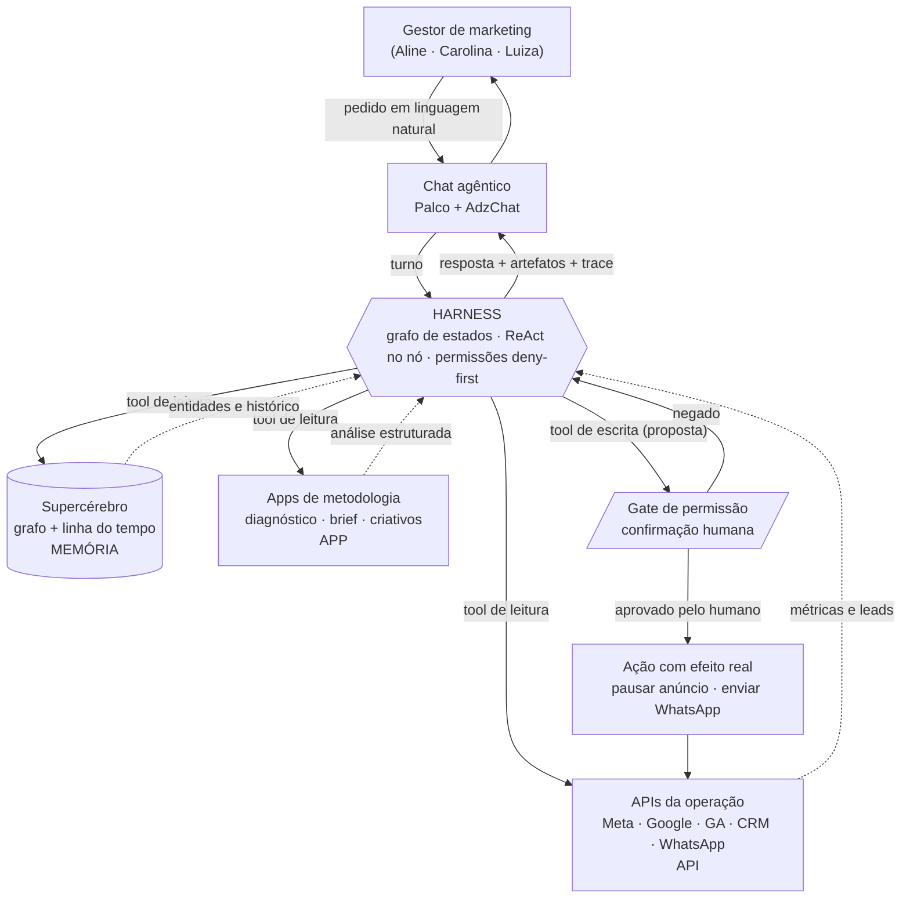
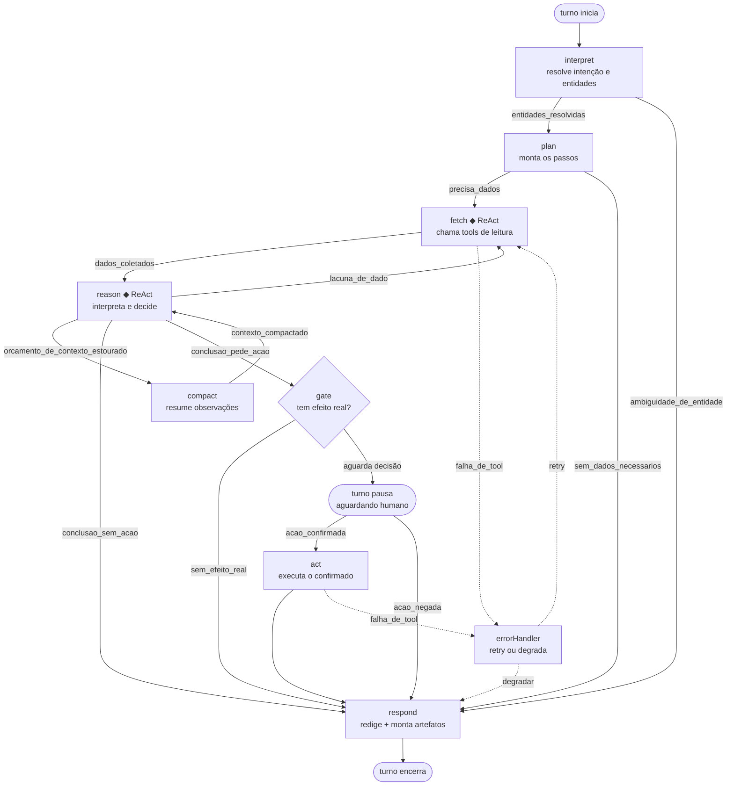

# Diagramas da arquitetura

Duas figuras. A **Figura 1** vai para o paper como visão de sistema; a **Figura 2** é o
grafo interno do harness. Ambas em Mermaid, sem cor semântica — precisam ser lidas em
preto e branco (a distinção é feita por forma e por rótulo, nunca por cor).

---

## Figura 1 — O harness entre o gestor e as três camadas

**Legenda da Figura 1**

| Elemento | O que é | Como o harness acessa |
|---|---|---|
| Supercérebro (cilindro) | **Memória** da operação: grafo de Pessoas, Campanhas, Canais, Tarefas + linha do tempo | Só por **tool** (`graph_query`, `timeline_query`). Nunca é despejado no prompt do sistema |
| Apps (retângulo) | **App** de metodologia: uma análise empacotada que devolve estrutura, não texto solto | Por **tool** (`app_diagnostico`, `propose_ctas`) |
| APIs (retângulo) | Fonte de dado bruto da operação | Por **tool** de leitura; escrita só via gate |
| Gate (paralelogramo) | Trava de permissão. Interrompe o turno e devolve um preview em PT-BR | Não é tool: é um **nó do grafo** |
| Setas cheias | Chamada do harness para fora | — |
| Setas tracejadas | Retorno que vira observação no estado | — |

A leitura da figura: **tudo que entra no contexto do modelo entra como retorno de tool.**
Não existe "contexto ambiente". Isso é o que torna cada afirmação da resposta rastreável
até uma linha do trace.

---

## Figura 2 — Grafo de estados interno

**Onde o loop ReAct vive:** apenas nos nós marcados com `◆` — `fetch` e `reason`.
Dentro deles o modelo pensa → chama tool → observa → repete, limitado por `maxSteps`.
Fora deles não há loop: `interpret`, `plan`, `gate`, `act` e `respond` são passagens
únicas (o `interpret` admite até 3 chamadas de resolução, mas sem re-planejamento).

**Onde o gate interrompe:** entre `reason` e `act`. O turno **para de verdade** — a
resposta HTTP fecha com `halt: 'awaiting_confirmation'`. A execução só retoma quando a UI
manda um novo `POST /api/chat` com `decision`. Não existe caminho de `reason` direto para
`act`.

**Ciclo fetch ⇄ reason:** teto de 3 ciclos por turno (`reactCycles`). Estourou, o grafo é
forçado por `conclusao_sem_acao` para `respond`, que redige com o que tem e **declara a
lacuna** em vez de inventar.

---

## Contrato de cada nó

| Nó | O que faz | Allowlist de tools | `maxSteps` | Condição de saída |
|---|---|---|---|---|
| `interpret` | Classifica a intenção e resolve os apelidos do gestor ("a Ômega 3", "essa semana") em ids do supercérebro e numa `TimeWindow` | `graph_query`, `timeline_query` | 3 | Toda entidade com `confidence ≥ 0,6` → `entidades_resolvidas`. Alguma abaixo → `ambiguidade_de_entidade` (pergunta em vez de chutar) |
| `plan` | Decide quais dados o pedido exige e emite `PlanStep[]`. Não chama tool — é a única chamada de LLM puramente deliberativa | — (vazia) | 1 | Plano com ≥1 passo → `precisa_dados`. Pedido respondível só com o supercérebro já lido → `sem_dados_necessarios` |
| `fetch` | Loop ReAct de **leitura**: escolhe tool, chama, transforma retorno em `Observation` | `graph_query`, `timeline_query`, `meta_ads_insights`, `google_ads_insights`, `ga_report`, `crm_leads`, `list_criativos`, `get_metrics` | 6 | Todos os `PlanStep` com dado coletado, **ou** `maxSteps` esgotado → `dados_coletados`. Erro retryable → `falha_de_tool` |
| `reason` | Loop ReAct de **análise**: cruza observações, testa e descarta hipóteses, pode acionar um App | `app_diagnostico`, `propose_ctas`, `graph_query`, `timeline_query` | 4 | Falta dado nomeado → `lacuna_de_dado`. Observações acima de 6k tokens → `orcamento_de_contexto_estourado`. Conclusão pronta sem efeito real → `conclusao_sem_acao`. Conclusão que exige write → `conclusao_pede_acao` |
| `compact` | Substitui observações antigas por um resumo, preservando números e fontes citadas | — (vazia) | 1 | Sempre → `contexto_compactado`. Registra `tokensBefore`/`tokensAfter` no trace |
| `gate` | Verifica se a tool proposta tem `effect: 'write'`, monta o `ActionPreview` em PT-BR e **para o turno** | — (vazia) | 1 | Tool de leitura mal roteada até aqui → `sem_efeito_real`. Write → emite `permission_request` e devolve `halt: 'awaiting_confirmation'` |
| `act` | Executa **exatamente** os `args` que foram mostrados no preview. Não re-infere nada | `pause_ads`, `send_whatsapp` | 2 | Sucesso ou falha não-retryable → `respond`. Falha retryable → `falha_de_tool` |
| `respond` | Redige a resposta em PT-BR e materializa os `StageArtifact` do Palco | — (vazia) | 1 | Sempre encerra o turno com `halt: 'done'` |
| `errorHandler` | Classifica o erro. Retryable e `attempt < 2` → volta ao nó de origem com backoff; caso contrário degrada | — (vazia) | 1 | `retry` ou `degradar` |

Duas travas independentes protegem a allowlist: o `NodeBudget` do nó e o campo
`allowedNodes` de cada `ToolDef`. Uma tool só executa se **as duas** permitirem — assim um
bug de configuração de nó não abre acesso a `pause_ads`.
